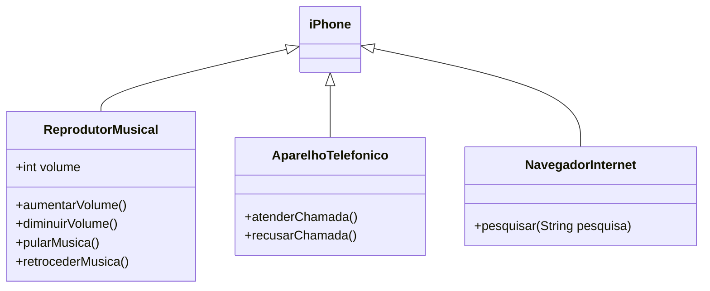

```mermaid
classDiagram
    iPhone <|-- ReprodutorMusical
    iPhone <|-- AparelhoTelefonico
    iPhone <|-- NavegadorInternet
    class ReprodutorMusical{
      +int volume
      +aumentarVolume()
      +diminuirVolume()
      +pularMusica()
      +retrocederMusica()
    }
    class AparelhoTelefonico{
      +atenderChamada()
      +recusarChamada()
    }
    class NavegadorInternet{
      +pesquisar(String pesquisa)
    }
```
